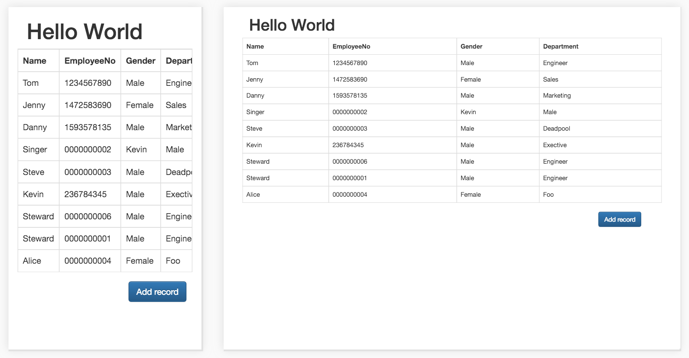
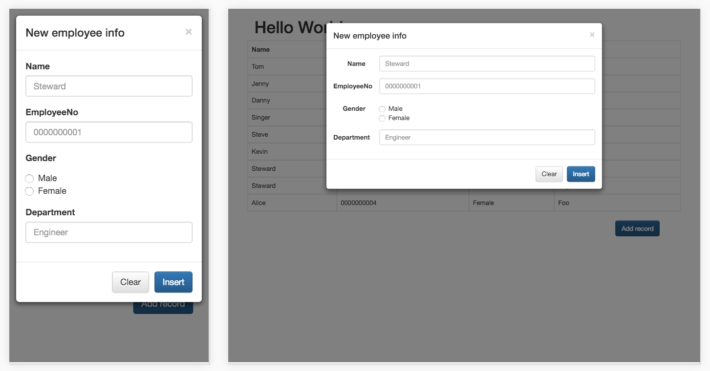

# EverFocus Code Challenge
[Here](http://calldll.pb732yiajr.us-west-1.elasticbeanstalk.com/) is the demo link on Amazon Web Service. [Here](Spec.md) is the spec for this project.

## Two possible approaches 
The latest solution for this challenge is to **interact with a database** on Google Cloud Storage where the `.csv` stores as a table `employee`, though the most straightforward approach is to **treat the `.csv` file as a text file** lying in the filesystem (e.g. Google Cloud Storage bucket), which has been also implemented [here](http://everfocuscodechallenge.appspot.com/).

## Responsive Design
The page is designed with Bootstrap.

 
 

## Call DLL with PHP
Windows and Linux (which Google Cloud Storage and Amazon Web Service use) use completely different executable formats (PE vs. ELF), so a DLL on Linux is definitely **NOT** a COM one. 

A DLL on Linux is `.so` ([**S**hared **O**bject](http://stackoverflow.com/a/9810368/5920930)) instead of `.dll` (**D**ynamic-**L**ink **L**ibrary) which you often see on Windows. Please refer to repository [Call DLL on Linux](https://github.com/AugustusZ/CallDllOnLinux) for more details.

## How files work together
*The section is kind of verbose ...*

There are four files as the source code for the final solution:

1. `index.php`
2. `Makefile`
3. `printHelloworld.c`
4. `returnHelloworld.c`

And this is how they work together:

1. `index.php`'s `shell_exec()` runs `Makefile` 
2. `Makefile` creates:
	1. `returnHelloworld.o` from `returnHelloworld.c`
	2. `returnHelloworld.so` (the Linux DLL) from `returnHelloworld.o`
	3. `printHelloworld` from `printHelloworld.c`
3. `index.php`'s `shell_exec()` runs `printHelloworld`
4. `printHelloworld`'s `main()` calls `returnHelloworld.so`'s `returnHelloworld()` (which returns `"Hello World"` as its name indicates)
5. `returnHelloworld.so` returns string `"Hello World"` to `printHelloworld`'s `main()`
6. `printHelloworld`'s `main()` prints the string `"Hello World"` to console, which is accordingly returned by `index.php`'s `shell_exec()` 

However, when embedded in HTML on Google App Engine, the code

	<h1>
		<?php echo shell_exec('./printHelloworld');?>
	</h1>

will **NOT** become

	<h1>
		Hello World
	</h1>

as we expect. This is because `shell_exec()` (along with other similar functions) has been permanently disabled in Google App Engine for the sake of security, as [Google official documentations](https://cloud.google.com/appengine/docs/php/runtime#PHP_Disabled_functions) indicates. This is very reason this project was finally deployed on AWS.
